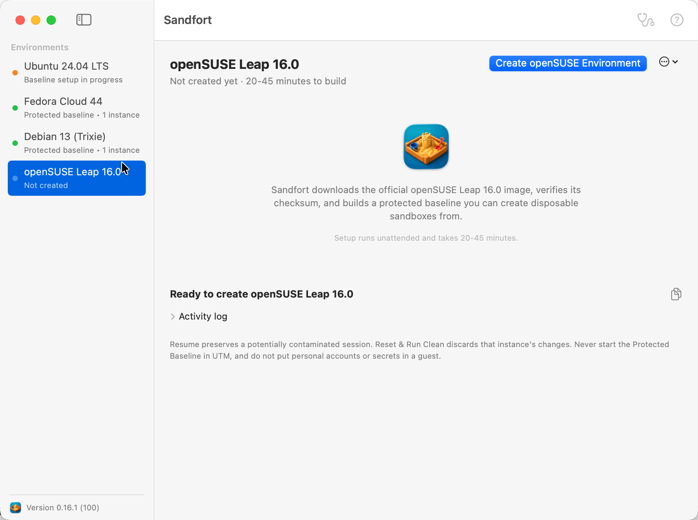

# Sandfort

 Sandfort is a native SwiftUI app that
creates disposable Ubuntu VMs for opening untrusted coding challenges. The first
provider supports Apple Silicon macOS and [UTM](https://mac.getutm.app/).

**A clean machine for untrusted work.**

Project site: [sandfort.app](https://sandfort.app/)

Sandfort was inspired in part by Elastic Security Labs' research into
[Contagious Interview malware using SVG steganography](https://www.elastic.co/security-labs/contagious-interview-malware-svg-steganography),
which illustrates the risks of running untrusted coding challenges directly on
a personal computer.

Read the [Sandfort Help guide](HELP.md) for complete operating, safety, and
troubleshooting instructions. The same source is packaged as the searchable
native Help Book available from **Help → Sandfort Help** in the app.

## Screenshot

## Quick start

1. Download and install [UTM](https://mac.getutm.app/).
2. Run `make app`.
3. Open `dist/Sandfort.app` and click **Create Sandbox**.
   Before creating or rebuilding, choose whether the baseline should include
   Python 3 development tools and the latest official Node.js LTS/npm. Git, curl,
   and jq are always included. Node's Linux ARM64 archive is SHA-256 verified.
   Advanced mode also accepts a custom shell script. It is embedded in cloud-init
   and runs as root inside Ubuntu during baseline creation, never on the macOS host.
4. The app downloads the official Ubuntu 24.04 ARM64 cloud image (about 590 MB),
   shows byte-based percentage progress, verifies Canonical's pinned SHA-256, and
   opens the generated VM in UTM.
5. First boot uses UTM's text terminal because Ubuntu cloud images send setup
   output to their serial console. Let it install the desktop, Git, curl, guest
   tools, firewall, and security updates. Leave it running until all selected
   tools are verified, setup journals and package caches are compacted, and the
   VM powers itself off automatically.
6. Click **Finish Setup**. UTM will clearly label the source VM as
   **Protected Baseline** and the first disposable VM as **Instance 1**.
7. Select an instance and use the **Run Instance** menu, or click
   **New Clean Sandbox** to create another numbered instance from the baseline.
   Give it an optional descriptive name for identification. Clean instances use
   the graphical desktop display and may run concurrently.

## Using clean sandboxes

Clean sessions use a small in-memory system journal. This avoids persistent
journal flushing during disposable boots and discards guest logs with the rest
of the clean session when it shuts down. Baseline setup also disables Ubuntu's
wait-online services so an unavailable network does not delay the graphical
login for up to two minutes.

The setup login uses a generated, memorable four-word hyphen-separated phrase
and is displayed in the app. Every numbered instance has an independent disk,
UEFI state, VM UUID, and MAC address. **Resume Instance** preserves its current
work and contamination. **Reset & Run Clean** restores only that instance from
the protected baseline. Always start instances through the app and never run the
Protected Baseline directly in UTM.

Reset removes the stopped instance's old UTM registration and recreates its
bundle before launch. This makes an already-open UTM library load the selected
offline or Internet mode instead of a cached configuration. The permanent
instance number and optional name remain, while its disposable VM UUID, MAC
address, disk, and UEFI state are freshly generated or restored.

During **Rebuild**, the app asks for the new baseline's Ubuntu password and
prefills the current password. The chosen value is validated before any existing
VM data is deleted, then applied by cloud-init and inherited by all new instances.
After confirmation, macOS may ask permission for Sandfort to control UTM. The
app uses that permission to remove the old protected baseline and every recorded
numbered instance from UTM's library before deleting their app-owned bundles. If
permission is denied, rebuild stops before deleting the current sandbox. Sandfort
opens UTM automatically if it is closed, then waits for UTM to confirm each
library removal before continuing. This prevents UTM from retaining a stale entry
while its deletion is still in progress.

Instance names can be changed later with **Run Instance → Rename Instance**.
The permanent instance number, bundle path, VM UUID, disk, and baseline
relationship do not change when a display name changes.

Use **Run Instance → Delete Instance** to remove a stopped instance. The app
moves its bundle to macOS Trash and removes it from saved state without changing
the Protected Baseline or other instances. Deleted instance numbers are not
reused. If UTM retains an unavailable entry, its trash button removes that stale
registration; destructive instance deletion remains app-owned.

Each instance creation and clean launch asks whether the guest should have Internet access. The default
is offline. Internet-enabled runs still disable shared folders, clipboard, USB
sharing, and incoming port forwarding, but UTM must relax guest-to-host network
isolation to provide outbound access.

## Native runtime

The distributed app does not bundle or invoke shell scripts, `osascript`,
AppleScript, `curl`, `qemu-img`, or `hdiutil`. Swift code performs the download,
streaming progress, SHA-256 verification, QCOW2 resize, ISO-9660 cloud-init media
creation, UTM plist generation, and launch through `NSWorkspace`.

Run tests with `make test`. Read [the architecture](docs/architecture.md) and
[security model](docs/security-model.md) before using the VM with hostile code.
